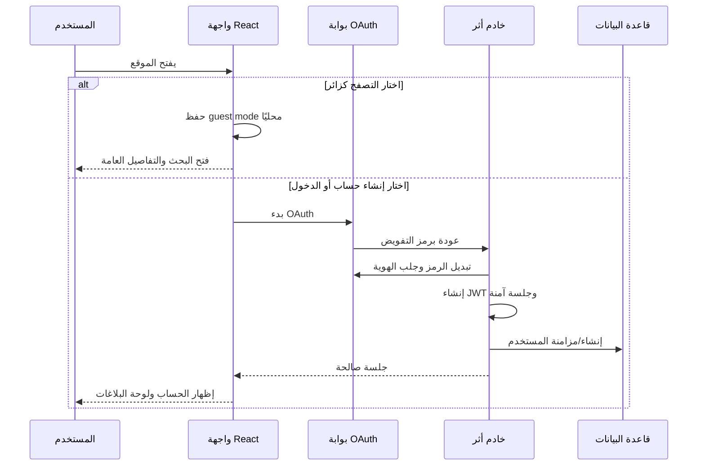

# الدليل التقني ورحلة المستخدم لمنصة أثر

**المشروع:** أثر للمفقودات والموجودات  
**إصدار الدليل:** 1.0  
**الغرض:** شرح البنية التقنية الحالية، ومسؤولية كل تقنية، وكيف ينتقل المستخدم من الدخول الأول إلى إدارة البلاغات والتطابقات والإشعارات.

> **فكرة المنصة:** أثر منصة عربية باتجاه RTL تساعد المجتمع على نشر بلاغات المفقودات والموجودات والبحث عنها، ثم عرض حالات متشابهة محتملة مع التأكيد أن التشابه ليس إثباتًا للملكية.

## 1. الملخص المعماري

تعتمد المنصة على تطبيق ويب كامل المكدس. تُبنى الواجهة باستخدام React، بينما يعمل خادم Express خلف واجهة tRPC موحدة. يحمل كل إجراء بياناته وأنواعه من TypeScript، ثم تمر الطلبات المعتمدة إلى طبقة البيانات Drizzle ORM وقاعدة MySQL/TiDB. تُحفظ الصور الاختيارية في تخزين كائنات S3 بدلاً من قاعدة البيانات.

```mermaid
flowchart RL
  U[المستخدم أو الزائر] --> UI[React + RTL UI]
  UI --> Q[React Query + tRPC Client]
  Q --> API[/api/trpc عبر Express]
  API --> CTX[Context: جلسة المستخدم والصلاحيات]
  CTX --> R[Report / Notification Routers]
  R --> V[Zod: التحقق من المدخلات]
  R --> DB[Drizzle ORM]
  DB --> SQL[(MySQL / TiDB)]
  R --> S3[تخزين S3 للصور]
  R --> M[محرك المطابقة]
  M --> DB
```

| الطبقة | التقنية الأساسية | المهمة في أثر |
| --- | --- | --- |
| واجهة المستخدم | React 19 + TypeScript | بناء الصفحات والمكونات والحالات التفاعلية باللغة العربية. |
| التصميم | Tailwind CSS 4 + Radix/shadcn patterns | نظام الألوان، RTL، الاستجابة للشاشات، عناصر الإدخال والتنبيهات. |
| التنقل | Wouter | عرض الصفحات حسب المسار، مثل `/search` و`/reports/new` و`/my-reports`. |
| نقل البيانات | tRPC 11 + React Query + SuperJSON | استدعاء إجراءات الخادم بأنواع مشتركة مع التخزين المؤقت وإعادة الجلب بعد التحديثات. |
| الخادم | Express 4 + Node.js | تشغيل التطبيق وتوجيه طلبات الواجهة ودمج المصادقة والخدمات. |
| التحقق | Zod 4 | التحقق من حقول البلاغ والصورة والمعرّفات قبل تشغيل أي إجراء حساس. |
| البيانات | Drizzle ORM + mysql2 + MySQL/TiDB | تعريف الجداول والاستعلامات والفهارس وحفظ البلاغات والمطابقات والإشعارات. |
| المصادقة | OAuth + JWT موقّع + Cookie آمن | إنشاء الجلسة، معرفة المستخدم الحالي، وتقييد الإجراءات الخاصة. |
| الملفات | AWS SDK/S3 helpers | حفظ صور البلاغات وإرجاع رابطها بدل تخزين الملف نفسه داخل قاعدة البيانات. |
| الاختبار والجودة | Vitest + TypeScript + Vite/esbuild | اختبار المنطق، فحص الأنواع، ثم إنشاء حزمة الإنتاج. |

React هو طبقة الواجهة التفاعلية، بينما يقدّم Vite دورة تطوير وبناء سريعة للتطبيق الأمامي. [1] [2] تستخدم المنصة tRPC لتمرير الأنواع بين العميل والخادم، وDrizzle لتعريف نموذج البيانات واستعلاماته بأسلوب TypeScript. [3] [4]

## 2. التقنيات ودور كل واحدة

### 2.1 React وTypeScript

تكتب الصفحات والمكونات بصيغة TSX. React مسؤول عن رسم الواجهة وإدارة الحالة المحلية؛ مثل حالة مرشحات البحث، فتح لوحة الإبلاغ عن تطابق، أو اختيار الدخول كزائر. أما TypeScript فيحمي العقد بين المكونات، وإجراءات tRPC، ونموذج البيانات؛ لذلك تقل احتمالات إرسال حقل خاطئ أو التعامل مع حالة لا يدعمها الخادم.

في المشروع تظهر هذه الطبقة بصورة رئيسية داخل `client/src/pages/` للصفحات، و`client/src/components/` للمكونات القابلة لإعادة الاستخدام، مثل `AppFrame`، و`ReportCard`، و`JourneyProgress`.

### 2.2 Tailwind CSS وواجهة RTL

Tailwind هو نظام تنسيق قائم على فئات صغيرة قابلة للتركيب. بدلاً من تكرار ملفات CSS منفصلة لكل عنصر، تُكتب المسافات والألوان والاستجابة داخل مكوّن الواجهة، بينما يحفظ `client/src/index.css` الرموز البصرية المشتركة مثل بطاقات الملخص، وشريط رحلة المستخدم، وبطاقات التقارير.

يُثبت اتجاه الواجهة عبر `dir="rtl"` في إطار التطبيق. لذلك تنعكس المحاذاة والتدفق والقراءة لتناسب العربية. تستخدم المنصة اللون الأخضر العميق للحالات الأساسية، وخلفيات فاتحة محايدة، ولمسات كهرمانية للحالات التي تحتاج انتباهًا.

### 2.3 Wouter للتنقل

Wouter هو موجّه خفيف للصفحات. يحدد `client/src/App.tsx` المسارات العامة، بينما تستخدم المكونات `Link` للانتقال من دون إعادة تحميل كاملة للصفحة.

| المسار | الصفحة | وظيفة المستخدم |
| --- | --- | --- |
| `/` | الصفحة الرئيسية | فهم الخدمة، رؤية الإحصاءات والبلاغات الحديثة، والبدء بالبحث أو الإبلاغ. |
| `/search` | البحث | التصفية حسب النوع والحالة والموقع والتاريخ. |
| `/reports/new` | بلاغ جديد | إضافة بلاغ مفقود أو موجود بعد تسجيل الدخول. |
| `/reports/:id` | تفاصيل البلاغ | قراءة المعلومات والإبلاغ عن تطابق عند توفر بلاغ آخر للمستخدم. |
| `/reports/:id/edit` | تعديل البلاغ | تعديل بلاغ يملكه المستخدم. |
| `/my-reports` | لوحة المستخدم | متابعة البلاغات والتطابقات وإغلاقها بحالة «تم الاسترجاع». |
| `/notifications` | الإشعارات | مراجعة التنبيهات المتعلقة بالتطابقات. |
| `/admin` | لوحة المشرف | مراجعة الظهور العام للبلاغات لمن يملك دور `admin`. |

### 2.4 tRPC وReact Query وSuperJSON

tRPC يجعل إجراءات الخادم عقدًا مباشرًا بين الواجهة والخادم؛ فلا توجد طبقة REST منفصلة أو ملفات types مكررة. يستدعي العميل مثلاً `trpc.report.list.useQuery()` للبحث، أو `trpc.report.create.useMutation()` لإضافة البلاغ. يتولى React Query حالات التحميل والخطأ وإعادة جلب البيانات بعد التعديل، بينما يسمح SuperJSON بتمرير أنواع مثل التواريخ دون فقد بنيتها. [3]

هذه الطبقة تفصل واجهة المستخدم عن التفاصيل الداخلية لقاعدة البيانات: الصفحة لا تعرف SQL ولا تتعامل مع اتصال قاعدة البيانات؛ هي فقط تستدعي الإجراء المسموح به.

### 2.5 Express وطبقة الخادم

Express هو خادم Node.js الذي يستضيف التطبيق. تمر حركة RPC تحت المسار `/api/trpc`. ينشئ الخادم سياق كل طلب، وفيه معلومات الطلب والاستجابة والمستخدم الحالي إن كانت هناك جلسة صالحة.

تُقسم خدمات المجال إلى وحدات صغيرة: `server/routers/reports.ts` للبلاغات، و`server/routers/notifications.ts` للإشعارات، و`server/db.ts` لعمليات التخزين والاستعلام. هذا التقسيم يجعل إضافة وظيفة مستقبلية، مثل طلبات الاسترجاع أو محادثة آمنة، أكثر انتظامًا من وضع كل المنطق في ملف واحد.

### 2.6 Zod للتحقق من المدخلات

قبل إنشاء البلاغ، يتحقق Zod من نوع البلاغ ونوع الحالة وطول الاسم والوصف والموقع والتاريخ وبيانات الاتصال. على سبيل المثال، يلزم أن يكون الاسم بين 2 و160 حرفًا، والوصف بين 8 و2000 حرف، كما تُقبل الصورة فقط إذا كانت بصيغة JPEG أو PNG أو WebP وبحد أقصى 4 ميغابايت.

هذا التحقق ليس مجرد تحسين للواجهة؛ فهو يُعاد داخل الخادم، ولذلك لا يستطيع عميل غير موثوق تجاوز القيود بمجرد تعديل المتصفح. Zod مصمم لتعريف مخططات TypeScript والتحقق من المدخلات وقت التشغيل. [5]

### 2.7 Drizzle ORM وقاعدة البيانات

Drizzle هو طبقة ORM تربط جداول MySQL/TiDB بأنواع TypeScript. تُعرّف الجداول في `drizzle/schema.ts`، وتُنفذ عمليات القراءة والكتابة في `server/db.ts`. توفر الفهارس على حقول مالك البلاغ والظهور العام والبحث لتسهيل الاستعلامات المتكررة. [4]

| الجدول | أهم الحقول | المسؤولية |
| --- | --- | --- |
| `users` | `openId`, `name`, `email`, `role` | هوية المستخدم القادمة من OAuth، ودوره `user` أو `admin`. |
| `reports` | النوع، الحالة، الوصف، الموقع، الصورة، بيانات الاتصال | مصدر الحقيقة لكل بلاغ وتاريخه ومالكِه وحالة مراجعته. |
| `report_matches` | البلاغ المصدر، المرشح، الدرجة، الحالة | حفظ النتائج المحتملة وربطها بالبلاغ الذي أنتجها. |
| `notifications` | المستخدم، البلاغ، العنوان، النص، المقروء | تنبيهات داخل التطبيق، خصوصًا وجود تطابق محتمل. |

### 2.8 المصادقة وOAuth وJWT

تبدأ المصادقة من الواجهة عبر `startLogin()`، ثم ينتقل المستخدم إلى بوابة OAuth. بعد الرجوع، يبدّل الخادم رمز التفويض برمز وصول، ويجلب بيانات المستخدم، ثم ينشئ JWT موقّعًا بخوارزمية HS256 ويحفظه في Cookie جلسة آمن. في الطلبات التالية يتحقق الخادم من التوقيع والصلاحية، ثم يبحث عن المستخدم أو ينشئه ويحدّث آخر دخول له.

يوجد مسار احتياطي باستخدام ترويسة `Authorization: Bearer` داخل المعاينة عند حجب cookies في بعض سياقات iframe أو التصفح الخاص. هذا ليس وضعًا مختلفًا للمستخدم النهائي؛ بل هو دعم تقني لبيئات العرض.

### 2.9 تخزين الصور في S3

لا تحفظ البايتات الخاصة بالصورة في جدول البلاغات. تُحوّل الصورة محليًا في المتصفح إلى Data URL، ويتحقق الخادم من النوع والحجم، ثم يرفعها إلى مسار شبيه بـ`reports/{userId}/{timestamp}.jpg` في S3. بعد ذلك لا تحفظ قاعدة البيانات إلا رابط الصورة `imageUrl`. هذا يمنع تضخم قاعدة البيانات ويحافظ على سرعة البحث والاستعلام.

يُستخدم AWS SDK للتعامل مع تخزين الكائنات وإنشاء الروابط اللازمة. [7]

### 2.10 الاختبارات والبناء

تشغّل `pnpm test` اختبارات Vitest، وتشمل المصادقة وتقييم المطابقة وإجراءات البحث وتحديث الحالة والصلاحيات ومنطق الدخول كزائر. يشغّل `pnpm check` فحص TypeScript بدون إنتاج ملفات، بينما يشغّل `pnpm build` بناء Vite للواجهة ثم حزمة esbuild للخادم. Vitest مخصص لتشغيل اختبارات JavaScript وTypeScript السريعة ضمن بيئة Vite. [6]

## 3. هيكل المجلدات

```text
shabwa-lost-found/
├── client/
│   └── src/
│       ├── pages/          صفحات المستخدم والمشرف
│       ├── components/     بطاقات، إطار التطبيق، شريط الرحلة، إرشادات النموذج
│       ├── lib/            عميل tRPC، أدوات الواجهة، منطق وضع الزائر
│       ├── _core/hooks/    useAuth لإدارة هوية المستخدم في الواجهة
│       ├── App.tsx         خريطة المسارات
│       └── index.css       نظام التصميم RTL والأنماط المشتركة
├── server/
│   ├── routers/            إجراءات البلاغات والإشعارات
│   ├── db.ts               استعلامات Drizzle ومنطق الحفظ
│   ├── matching.ts         حساب درجة التشابه
│   ├── storage.ts          واجهة تخزين الصور
│   └── _core/              OAuth، الجلسات، context، tRPC، الخادم
├── drizzle/
│   ├── schema.ts           تعريف نموذج البيانات
│   └── migrations/         ملفات ترحيل القاعدة
├── docs/                   توثيق المشروع ورحلة المستخدم
└── package.json            الحزم وأوامر التطوير والبناء والاختبار
```

## 4. رحلة المستخدم بالتفصيل

### 4.1 الوصول الأول: الحساب أو وضع الزائر

عند دخول زائر غير مسجل ولم يسبق له اختيار وضع الزائر، تظهر شاشة ترحيب تقدم قرارًا واضحًا:

| الخيار | ما الذي يمكن فعله؟ | ما الذي يتطلب حسابًا؟ |
| --- | --- | --- |
| **الدخول كزائر** | قراءة الصفحة الرئيسية، البحث، فتح التفاصيل العامة | إنشاء بلاغ، تعديل بلاغ، رؤية لوحة شخصية، إرسال بلاغ تطابق، قراءة الإشعارات. |
| **إنشاء حساب أو تسجيل الدخول** | كل مزايا الزائر إضافة إلى الملكية الشخصية للبلاغات | لا توجد قيود وظيفية خاصة بالمستخدم العادي. |

يُحفظ قرار وضع الزائر محليًا في `localStorage` حتى لا تعود نافذة الاختيار في كل تنقل. عند نجاح الدخول بحساب، يُزال هذا الخيار المحلي وتتحول الواجهة إلى هوية المستخدم المسجل.



### 4.2 الاستكشاف والبحث

بعد الدخول أو المتابعة كزائر، يمكن للمستخدم فتح الصفحة الرئيسية التي تعرض إحصاءات موجزة وأحدث البلاغات. تقود الأزرار إلى البحث أو إنشاء بلاغ. داخل البحث، يستطيع المستخدم تطبيق مرشحات مستقلة أو مجتمعة: النص، النوع، حالة مفقود/موجود، حالة البلاغ، الموقع، وتاريخ البداية والنهاية.

يرسل العميل هذه المرشحات إلى الإجراء العام `report.list`. لا يحتاج هذا الإجراء إلى جلسة لأن المعلومات المنشورة عامة. عند عدم وجود نتائج، تعرض الواجهة إجراءين واضحين: إزالة المرشحات أو إضافة بلاغ جديد.

### 4.3 إنشاء البلاغ

هذه المرحلة محمية بحساب. عند زيارة `/reports/new` من دون جلسة، تشرح المنصة أن المستخدم يحتاج تسجيل دخول لإدارة البلاغ واستقبال التنبيهات. بعد الدخول يتبع المستخدم هذا التسلسل:

1. يختار هل البلاغ **مفقود** أم **موجود**.
2. يختار نوع الحالة: **شخص** أو **حيوان** أو **غرض**.
3. يكتب العنوان والوصف والتاريخ والموقع، ويمكنه إضافة اسم ورقم للتواصل.
4. يمكنه إضافة صورة اختيارية؛ تتحقق الواجهة من النوع والحجم ثم يكرر الخادم التحقق قبل الرفع.
5. يضغط **«نشر البلاغ ومقارنة التطابقات»**.
6. ينشئ الخادم البلاغ باسم المستخدم الحالي، ثم يشغّل المطابقة ويحفظ النتائج المناسبة.
7. تظهر شاشة نجاح مع بطاقات التطابقات المرشحة مباشرة إن وُجدت.

تظهر قبل النموذج إرشادات عملية: عدم نشر عنوان حساس، وإضافة علامة مميزة، وعدم تضمين رقم هوية أو بيانات خاصة داخل الوصف. هذه الإرشادات تقلل الاحتكاك وتحسن جودة المعلومات التي تصل إلى محرك المطابقة.

### 4.4 منطق المطابقة

المطابقة الحالية **خوارزمية إرشادية شفافة** وليست ذكاءً اصطناعيًا ولا تحققًا قانونيًا للملكية. ترفض مباشرة مقارنة بلاغين من نفس الاتجاه؛ أي لا تقارن مفقودًا بمفقود أو موجودًا بموجود. ثم تحسب درجة من 0 إلى 100 حسب العناصر التالية:

| العامل | الوزن الأقصى | كيف يُحسب؟ |
| --- | ---: | --- |
| نوع الحالة | 24 | نفس النوع: شخص/حيوان/غرض. |
| العنوان أو الاسم | 30 | تشابه الكلمات باستخدام Jaccard similarity. |
| الوصف | 22 | تشابه الكلمات الدالة داخل الوصف. |
| الموقع | 14 | تشابه كلمات المدينة أو الحي أو المعلم. |
| التاريخ | 10 | قرب التاريخ: يوم، أسبوع، أو شهر. |

تُحفظ النتيجة فقط إذا بلغت عتبة `45` أو أكثر. لا تكشف الدرجة ملكية الغرض؛ لذلك تعرض الواجهة تنبيهًا يطلب من المستخدم التحقق من علامة لا تظهر في البلاغ العام قبل التواصل أو التسليم.

### 4.5 التفاصيل والإبلاغ عن تطابق

تعرض صفحة التفاصيل معلومات البلاغ المنشورة، الموقع المكتوب، التاريخ، حالة البلاغ، وبيانات التواصل إن قدمها صاحب البلاغ. عند وجود حالة مفتوحة، يظهر زر **«الإبلاغ عن تطابق»**.

عند الضغط، لا يرسل النظام اتصالًا مباشرًا تلقائيًا. يسجل المستخدم أولًا، ثم يختار بلاغًا آخر يملكه للمقارنة. تحفظ المنصة الحالة كـ`reported` داخل جدول المطابقات لتصبح إشارة قابلة للمراجعة، بدلاً من إعلان استرجاع تلقائي قد يكون خاطئًا.

### 4.6 لوحة المستخدم

لوحة `/my-reports` لا تعرض قائمة فقط؛ بل تبدأ بملخص لثلاث حالات: إجمالي البلاغات، البلاغات التي تحتاج متابعة، والحالات المغلقة بعبارة **«تم الاسترجاع»**. لكل بلاغ إجراءات ثابتة:

| الإجراء | نتيجة الإجراء |
| --- | --- |
| عرض | يفتح الصفحة العامة للبلاغ. |
| تعديل | يسمح بتعديل البيانات طالما يملك المستخدم البلاغ. |
| مطابقات | يجلب النتائج المخزنة ويعرضها مرتبة بالدرجة. |
| تم الاسترجاع | يغيّر الحالة إلى `recovered` ويضع تاريخ الإغلاق. |

الخادم يتحقق من الملكية قبل التعديل أو الاسترجاع أو قراءة التطابقات. يستثنى المشرف من هذا القيد فقط في نطاق الإشراف المصرح به.

### 4.7 الإشعارات

توجد الإشعارات داخل التطبيق. عندما يولد بلاغ جديد حالة مشابهة لبلاغ قائم، تنشأ رسالة مرتبطة بالمستخدم وبلاغه. صفحة الإشعارات تفرز ما يحتاج مراجعة، وتتيح فتح البلاغ أو وضع الإشعار كـ«تمت القراءة».

> الإصدار الحالي يقدم **إشعارات داخل المنصة**. لا يرسل بعد رسائل SMS أو بريدًا أو Push Notification خارج المتصفح؛ وهذه إضافة مستقبلية ممكنة.

### 4.8 المشرف

يصل المستخدم صاحب الدور `admin` فقط إلى `/admin`. تعرض لوحة المشرف ملخصًا للطابور، وما يحتاج قرارًا، وما هو منشور للعامة. يستطيع المشرف فتح البلاغ ثم نقل حالته بين `published` و`under_review`. على الجوال تظهر البلاغات كبطاقات بدلاً من جدول عريض، وعلى سطح المكتب تظهر في جدول مهيأ للمراجعة السريعة.

## 5. الصلاحيات والخصوصية

| الإجراء | زائر | مستخدم مسجل | مشرف |
| --- | ---:| ---:| ---:|
| رؤية البلاغات المنشورة والبحث | نعم | نعم | نعم |
| إنشاء بلاغ أو رفع صورة | لا | نعم | نعم |
| تعديل أو إغلاق بلاغ مملوك | لا | نعم | نعم ضمن صلاحيات الإدارة |
| قراءة الإشعارات الشخصية | لا | نعم | نعم لحسابه فقط |
| إرسال بلاغ عن تطابق | لا | نعم، لبلاغاته | نعم ضمن صلاحياته |
| مراجعة ظهور جميع البلاغات | لا | لا | نعم |

تشمل ضوابط الأمان الحالية التحقق الخادمي من المدخلات، والتحقق من ملكية البلاغ قبل التعديل، وقصر إجراءات الإدارة على دور المشرف، والتحقق من نوع وحجم الصور. كما تتجنب الواجهة عرض تفاصيل موقع أدق من النص الذي يكتبه صاحب البلاغ.

## 6. أوامر التطوير والصيانة

| الأمر | الاستخدام |
| --- | --- |
| `pnpm dev` | تشغيل خادم التطوير مع إعادة تحميل تلقائية. |
| `pnpm test` | تشغيل اختبارات Vitest. |
| `pnpm check` | فحص TypeScript دون توليد ملفات. |
| `pnpm build` | بناء الواجهة والخادم لإنتاج نسخة النشر. |
| `pnpm format` | تطبيق تنسيق Prettier على الملفات. |
| `pnpm drizzle-kit generate` | توليد ترحيل قاعدة البيانات بعد تغيير `schema.ts`. |

> عند إضافة جدول أو عمود جديد، يجب اتباع الترتيب: تعديل `drizzle/schema.ts`، توليد ملف SQL، مراجعته، تطبيقه، ثم إضافة دوال `server/db.ts` وإجراء tRPC وواجهة المستخدم والاختبار.

## 7. فرص التطوير التالية

يمكن تطوير المنصة تدريجيًا دون تغيير البنية الحالية عبر إضافة خرائط لاختيار منطقة عامة، وطلبات استرجاع موثقة، وتحميل عدة صور، وإشعارات خارجية، وسجل تدقيق للمشرف، أو تحسين محرك المطابقة. يمكن استبدال عامل التشابه النصي لاحقًا بخدمة ذكاء اصطناعي، لكن ينبغي إبقاء نتيجة المطابقة **توصية قابلة للمراجعة** لا حكمًا تلقائيًا بالملكية.

## المراجع

[1]: https://react.dev/learn "React — Learn"
[2]: https://vite.dev/guide/ "Vite — Guide"
[3]: https://trpc.io/docs "tRPC — Documentation"
[4]: https://orm.drizzle.team/docs/overview "Drizzle ORM — Documentation"
[5]: https://zod.dev/ "Zod — Documentation"
[6]: https://vitest.dev/guide/ "Vitest — Guide"
[7]: https://docs.aws.amazon.com/AmazonS3/latest/userguide/Welcome.html "Amazon S3 — User Guide"

**مراجع داخلية للمشروع:** `package.json`، `drizzle/schema.ts`، `server/routers/reports.ts`، `server/_core/sdk.ts`، `server/matching.ts`، و`docs/user-lifecycle-review.md`.
